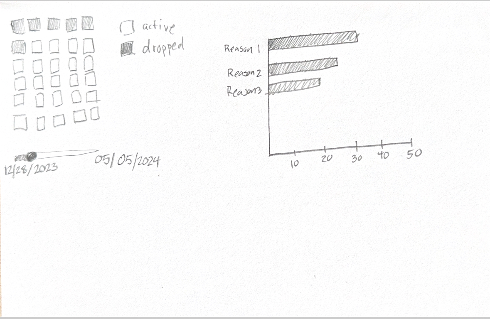

# Final Proposal
I am interested in analyzing the dropout data from the CUNY Spring Forward program. As the Data Coordinator, I examine the engagement of students who participated from the time they apply to the program to when they accept their position until the program has finished. A total of 7,606 students applied, with 1,265 committing to the program, with that 382 students dropped from the program by it's end. 

For my visualizations, I plan to create a waffle chart to display all 1,265 participants and use color coding to highlight those who dropped out. If possible, I will animate the chart using the dropout dates to dynamically illustrate when each dropout occurred. Additionally, I will generate a bar chart to depict the reasons for dropout as indicated on the dropout forms.

Understanding attrition in the program is crucial for setting our goals, so visualizing this data is key to effectively managing the program and help leadership understand how we set our targets so we have enough students to participate and give internships too. 

### Refrences
https://multimedia.report/classes/coding/2019/exercises/basicwafflechart/ (Waffle Chart Code)
https://github.com/datavizdad/d3areachartseries/tree/main/part%203 (Date Slider)